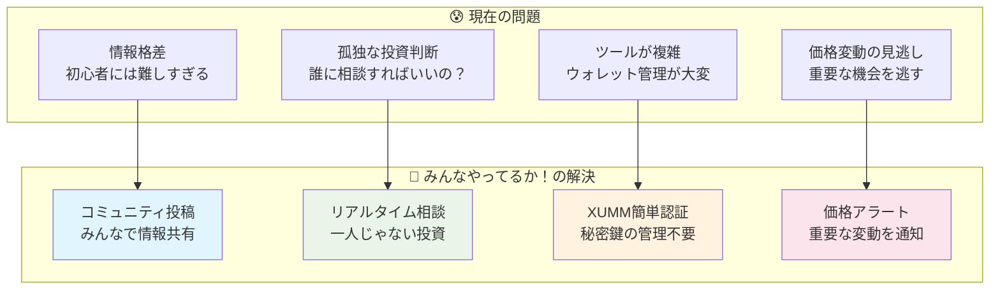
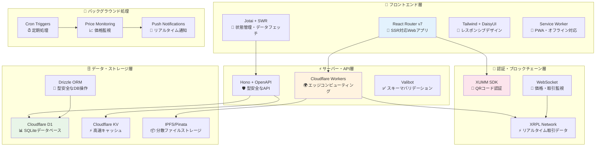
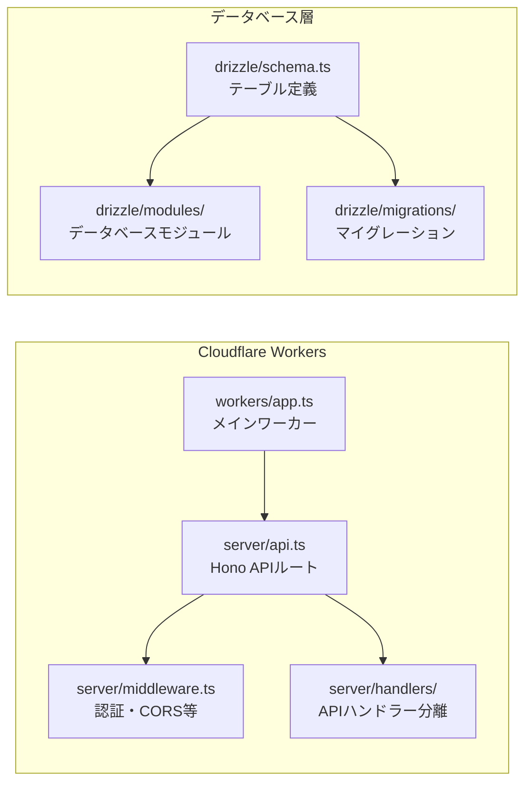
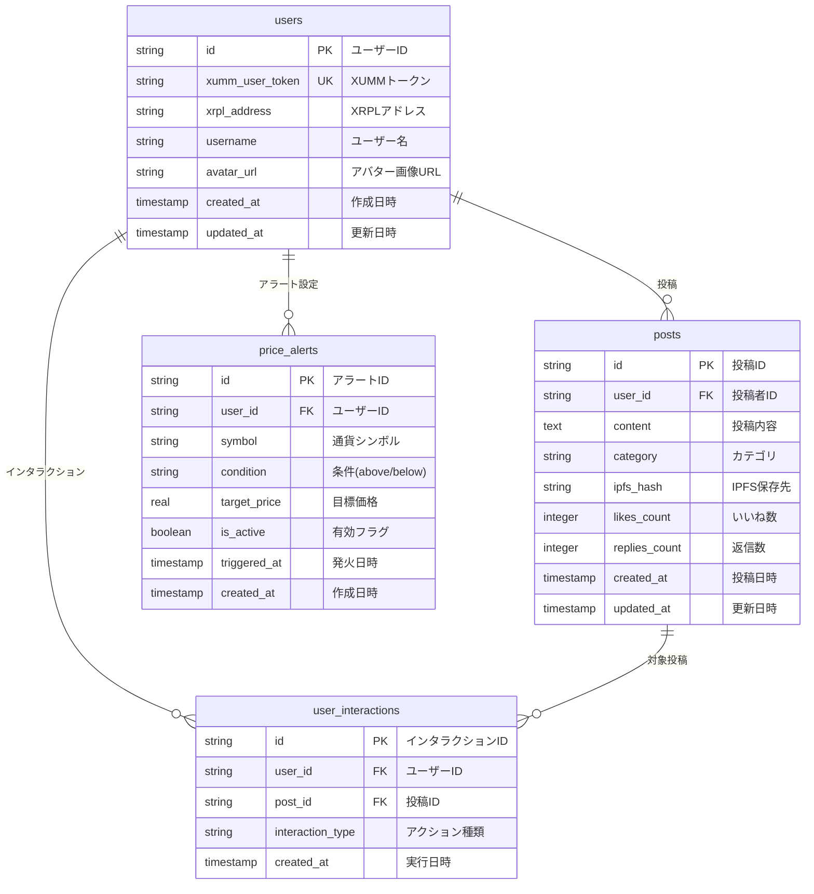

# 🎯 みんなやってるか！

> **暗号通貨投資をもっと身近に、みんなで一緒に成長できるプラットフォーム**

[](https://やってるか.みんな)
[](https://app.akindo.io/communities/63GvLV91NCNjA93j/products/WjKnoVK7DC3jNJz21?tab=overview)
[](https://reactrouter.com/)
[](https://xrpl.org/)
[](https://workers.cloudflare.com/)

**🌐 今すぐ体験**: https://やってるか.みんな

---

## 🌟 プロジェクト概要

### 💡 ビジョン

「みんなやってるか！」は、**暗号通貨投資の民主化**を目指すコミュニティ主導型プラットフォームです。専門用語ばかりで難しい暗号通貨の世界を、**「みんな」で支え合い、情報を共有し、一緒に成長できる場**に変えることを目指しています。

### 🎯 解決する課題



### 📊 プロジェクト基本情報

| 項目               | 内容                                                                    |
| ------------------ | ----------------------------------------------------------------------- |
| **プロジェクト名** | みんなやってるか！(Minna Yatteru Ka!)                                   |
| **開発期間**       | 14 日間で MVP 完成                                                      |
| **開発体制**       | 1 名（フルスタック開発）                                                |
| **対象ユーザー**   | 暗号通貨初心者〜中級者                                                  |
| **現在の状況**     | ✅ 本番環境で稼働中                                                     |
| **ハッカソン**     | [Akindo.io](https://app.akindo.io/communities/63GvLV91NCNjA93j/products/WjKnoVK7DC3jNJz21?tab=overview) 提出済み |

---

## 🏗️ システムアーキテクチャ

### 全体構成図



### 技術スタック詳細

#### フロントエンド

```mermaid
graph LR
    subgraph "React Router v7 エコシステム"
        A[app/root.tsx<br/>アプリケーションルート]
        B[app/provider.tsx<br/>Jotai + SWR統合]
        C[app/layout.tsx<br/>レイアウトテンプレート]
        D[app/routes/<br/>ページルート定義]
    end

    subgraph "コンポーネント構成"
        E[components/ui/<br/>UIプリミティブ]
        F[components/xrp/<br/>XRPL機能コンポーネント]
        G[components/layout/<br/>レイアウトコンポーネント]
        H[XrplDex.tsx<br/>DEX取引UI (785行)]
    end

    A --> B
    B --> C
    C --> D
    D --> E
    D --> F
    D --> G
    F --> H
```

#### バックエンド・API



---

## 🎨 主要機能

### 🔐 XUMM 認証システム

- **QR コード認証**: スマホでスキャンするだけの簡単ログイン
- **秘密鍵不要**: XUMM アプリが安全に管理
- **セッション管理**: [`app/cookie.server.ts`](app/cookie.server.ts)で実装

### 💱 XRPL DEX 機能

- **完全統合 DEX**: [`app/components/xrp/XrplDex.tsx`](app/components/xrp/XrplDex.tsx) (785 行)
- **jotai + useSWR 最適化**: メモリ効率的な状態管理
- **リアルタイム価格**: WebSocket での即座更新
- **スワップ・送金・Trust Line**: 全 XRPL 機能対応

### 📊 ダッシュボード機能

- **統合ダッシュボード**: [`app/routes/dashboard/dashboard.tsx`](app/routes/dashboard/dashboard.tsx) (306 行)
- **ポートフォリオ管理**: リアルタイム残高・取引履歴
- **価格アラート**: カスタム条件での通知設定

### 📈 チャート・分析

- **TradingView 統合**: [`app/routes/chart/`](app/routes/chart/)
- **市場分析**: リアルタイムデータ表示
- **高度なチャート機能**: ローソク足・テクニカル指標

---

## 🗄️ データベース設計

### ERD（エンティティ関係図）



---

## 📁 プロジェクト構造

### ディレクトリ構成

```
getting/
├── 📱 app/                          # React Router v7 アプリケーション
│   ├── 🧩 components/               # 再利用可能コンポーネント
│   │   ├── ui/                     # UIプリミティブ
│   │   ├── xrp/                    # XRPL機能コンポーネント
│   │   │   ├── XrplDex.tsx        # 統合DEX (785行)
│   │   │   ├── XummAuth.tsx       # XUMM認証 (173行)
│   │   │   ├── Networks.tsx       # ネットワーク管理 (382行)
│   │   │   ├── XrplClient.tsx     # XRPL接続 (108行)
│   │   │   └── FetchRpc.tsx       # RPC通信 (76行)
│   │   └── layout/                # レイアウトコンポーネント
│   ├── 🛣️ routes/                   # ページルート
│   │   ├── dashboard/             # ダッシュボード
│   │   │   └── dashboard.tsx      # メインダッシュボード (306行)
│   │   ├── home/                  # ホームページ
│   │   ├── community/             # コミュニティ機能
│   │   ├── chart/                 # チャート機能
│   │   ├── portfolio/             # ポートフォリオ
│   │   ├── alerts/                #価格アラート
│   │   └── login/                 # ログイン・認証
│   ├── 🔧 utils/                    # ユーティリティ関数
│   │   ├── xrpl.ts                # XRPL接続管理 (541行)
│   │   ├── xumm.ts                # XUMM SDK統合 (74行)
│   │   ├── storage.ts             # ストレージ管理 (394行)
│   │   ├── dig.ts                 # データ取得・解析 (312行)
│   │   ├── useStore.ts            # ストア管理 (88行)
│   │   └── hash.ts                # ハッシュ機能 (73行)
│   ├── root.tsx                   # アプリケーションルート (51行)
│   ├── provider.tsx               # Jotai + SWR統合 (32行)
│   ├── layout.tsx                 # レイアウトテンプレート (21行)
│   └── cookie.server.ts           # セッション管理 (17行)
├── 🗄️ drizzle/                      # データベース関連
│   ├── schema.ts                  # テーブル定義 (96行)
│   ├── modules/                   # データベースモジュール
│   └── migrations/                # マイグレーションファイル
├── ⚡ server/                       # API・サーバー
│   ├── api.ts                     # Hono APIルート (216行)
│   ├── middleware.ts              # 認証・CORS等 (68行)
│   ├── handlers/                  # APIハンドラー分離
│   └── schema/                    # Valibotスキーマ
├── 🌐 workers/                      # Cloudflare Workers
├── 📚 docs/                         # ドキュメント
├── 🎯 .cursor/                      # Cursor AI設定
├── sw.ts                          # Service Worker (91行)
├── wrangler.jsonc                 # Cloudflare設定 (59行)
└── package.json                   # 依存関係・スクリプト (79行)
```

### 主要ファイルの役割

| ファイル                                                                   | 行数   | 役割                                |
| -------------------------------------------------------------------------- | ------ | ----------------------------------- |
| [`app/components/xrp/XrplDex.tsx`](app/components/xrp/XrplDex.tsx)         | 785 行 | **🎯 統合 DEX 機能** (最新最適化版) |
| [`app/utils/xrpl.ts`](app/utils/xrpl.ts)                                   | 541 行 | XRPL 接続・データ取得               |
| [`app/utils/storage.ts`](app/utils/storage.ts)                             | 394 行 | ローカルストレージ管理              |
| [`app/components/xrp/Networks.tsx`](app/components/xrp/Networks.tsx)       | 382 行 | ネットワーク管理・切り替え          |
| [`app/utils/dig.ts`](app/utils/dig.ts)                                     | 312 行 | XRPL データ解析・取得               |
| [`app/routes/dashboard/dashboard.tsx`](app/routes/dashboard/dashboard.tsx) | 306 行 | メインダッシュボード                |
| [`server/api.ts`](server/api.ts)                                           | 216 行 | RESTful API・OpenAPI 仕様           |
| [`app/components/xrp/XummAuth.tsx`](app/components/xrp/XummAuth.tsx)       | 173 行 | XUMM 認証・QR コード                |

---

## 🚀 開発・デプロイ

### 開発環境セットアップ

```bash
# 1. 依存関係インストール
bun install

# 2. 環境変数設定
cp .env.example .dev.vars

# 3. データベース初期化
bun run db:generate
bun run db:migrate
bun run db:seed

# 4. 開発サーバー起動
bun run dev
```

### 主要コマンド

```bash
# 開発
bun dev                    # 開発サーバー起動
bun run typecheck         # 型チェック
bun run lint              # コード品質チェック

# データベース
bun run db:studio         # Drizzle Studio起動
bun run db:migrate        # マイグレーション実行
bun run db:seed           # シードデータ投入

# デプロイ
bun run build             # プロダクションビルド
bun run deploy            # Cloudflareにデプロイ
```

### 最新技術選定理由

| 技術                   | バージョン | 選定理由                                     |
| ---------------------- | ---------- | -------------------------------------------- |
| **React**              | v19.1.0    | 最新 Concurrent Features、Server Components  |
| **React Router**       | v7.6.2     | 最新の SSR 対応、ファイルベースルーティング  |
| **Cloudflare Workers** | -          | エッジコンピューティング、グローバル高速配信 |
| **Hono**               | v4.7.11    | 軽量高速、OpenAPI 統合、型安全性             |
| **Drizzle ORM**        | v0.44.2    | 型安全、パフォーマンス、SQLite サポート      |
| **XUMM**               | v1.8.0     | 秘密鍵管理不要、UX 優秀、XRPL 統合           |
| **Jotai**              | v2.12.5    | 軽量状態管理、React Suspense 対応            |
| **SWR**                | v2.3.3     | データフェッチング、キャッシュ最適化         |
| **Valibot**            | v1.1.0     | 軽量バリデーション、TypeScript 統合          |
| **XRPL**               | v4.3.0     | 最新 XRPL 機能、WebSocket 対応               |
| **TypeScript**         | v5.8.3     | 最新型システム、厳密な型チェック             |

---

## 🎯 最新アーキテクチャの特徴

### ⚡ パフォーマンス最適化

- **jotai + useSWR 統合**: useMemo を完全排除、宣言的状態管理
- **React 19 対応**: Concurrent Features 活用
- **エッジコンピューティング**: Cloudflare Workers で 50ms 以下応答
- **Service Worker**: オフライン対応・PWA 機能

### 🔐 セキュリティ強化

- **XUMM 統合**: 秘密鍵をクライアントで一切管理しない
- **Valibot**: 全 API 入力の厳密バリデーション
- **Cloudflare 保護**: DDoS・セキュリティ脅威から自動防御

### 🌐 スケーラビリティ

- **D1 データベース**: SQLite 基盤、自動スケーリング
- **IPFS 統合**: 分散ファイルストレージ
- **KV ストア**: 高速キャッシュ・セッション管理

---

## 📈 パフォーマンス指標

### Core Web Vitals

- **LCP**: < 1.2s (Cloudflare Workers + SSR)
- **FID**: < 100ms (軽量 JavaScript)
- **CLS**: < 0.1 (安定したレイアウト)

### 技術的メトリクス

- **バンドルサイズ**: < 200KB (gzip)
- **初回描画**: < 800ms
- **API 応答時間**: < 50ms (エッジ配信)
- **データベースクエリ**: < 10ms (D1 + インデックス)

---

## 🔗 関連リンク

### 🌐 本番環境

- **メインサイト**: https://やってるか.みんな
- **API 仕様**: https://やってるか.みんな/openapi.json

### 🏆 ハッカソン

- **提出ページ**: [Akindo.io](https://app.akindo.io/communities/63GvLV91NCNjA93j/products/WjKnoVK7DC3jNJz21?tab=overview)
<!-- - **デモ動画**: [YouTube](https://youtube.com/watch?v=demo) -->

### 🔧 開発ツール

- **Drizzle Studio**: `bun run db:studio`
- **API Explorer**: https://やってるか.みんな/api/v1
- **Cloudflare Dashboard**: [Workers Console](https://dash.cloudflare.com/)

---

## 🤝 コントリビューション

このプロジェクトは現在個人開発ですが、将来的にはコミュニティ主導での開発を予定しています。

### 開発に参加したい方

1. **Issue 作成**: バグ報告・機能提案
2. **Pull Request**: コード改善・新機能
3. **ドキュメント**: 翻訳・説明改善
4. **テスト**: ユーザビリティテスト

---

## 📄 ライセンス

MIT License - 詳細は [LICENSE](LICENSE) ファイルを参照してください。

---

<div align="center">

**🎯 みんなやってるか！**

_暗号通貨投資をもっと身近に、みんなで一緒に成長しよう_

[](https://github.com/boborder)
[](https://twitter.com/dayjobdoor)

</div>
