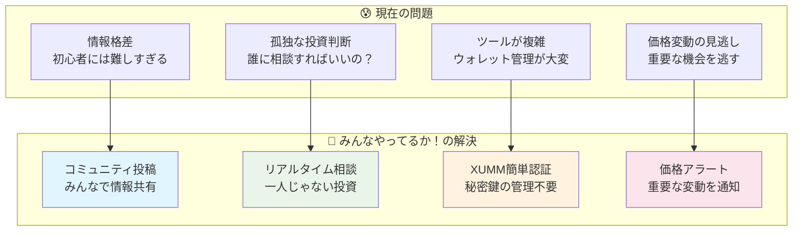
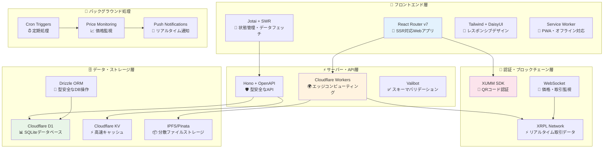
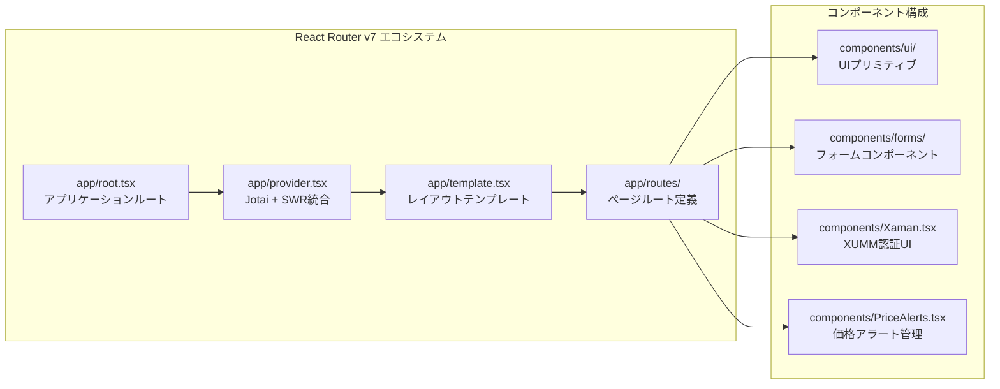
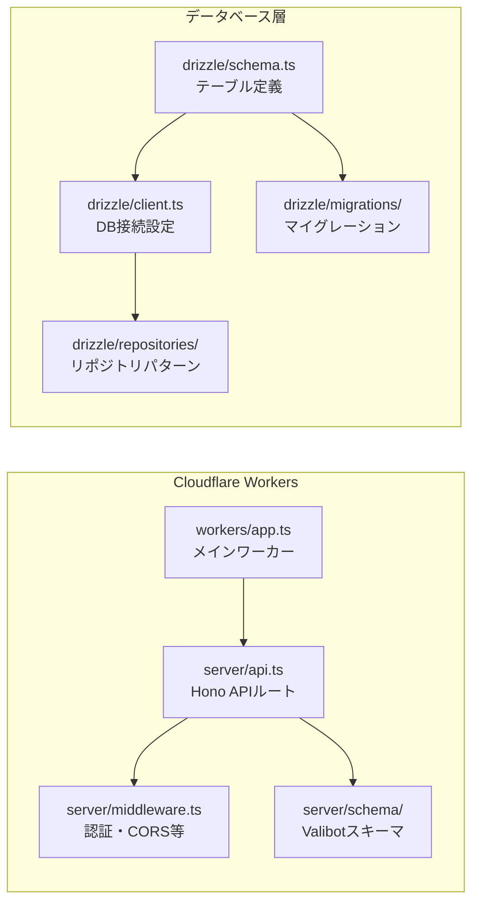
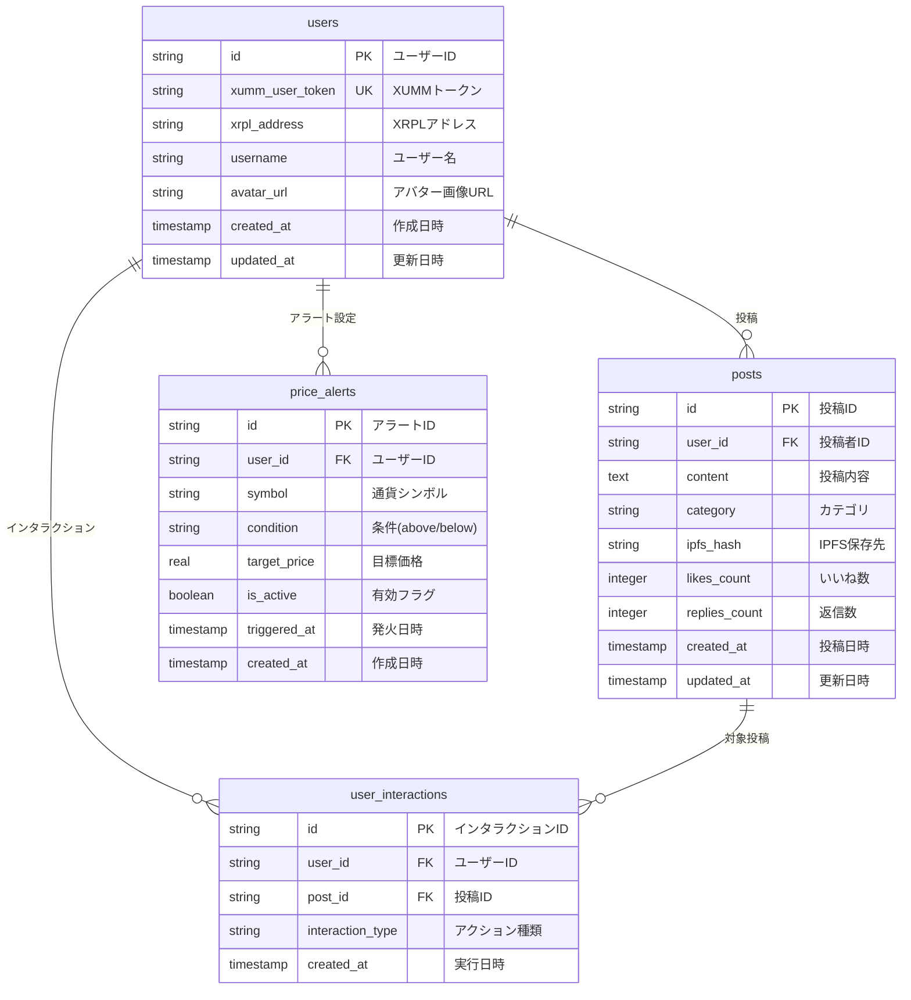
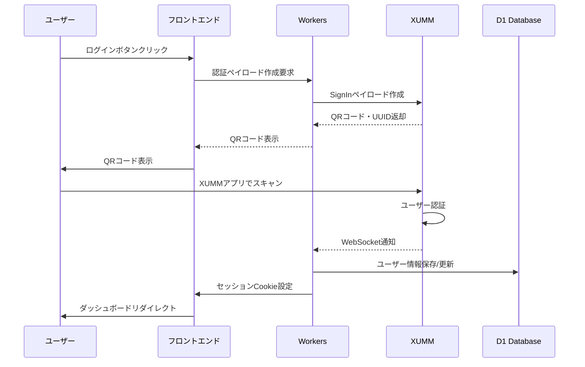
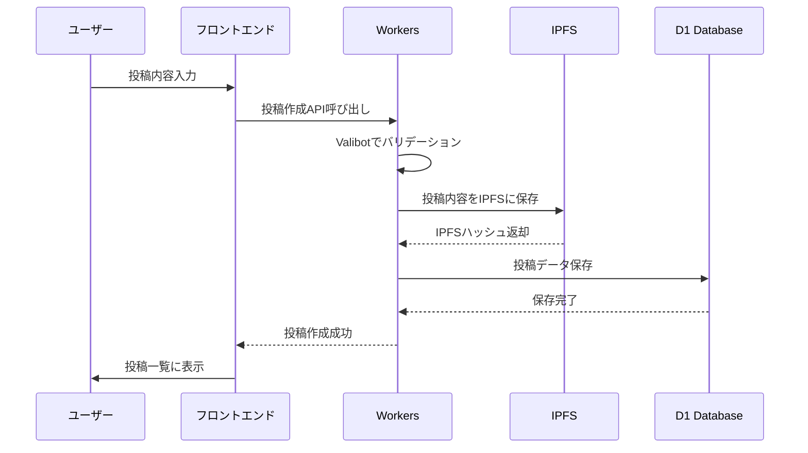
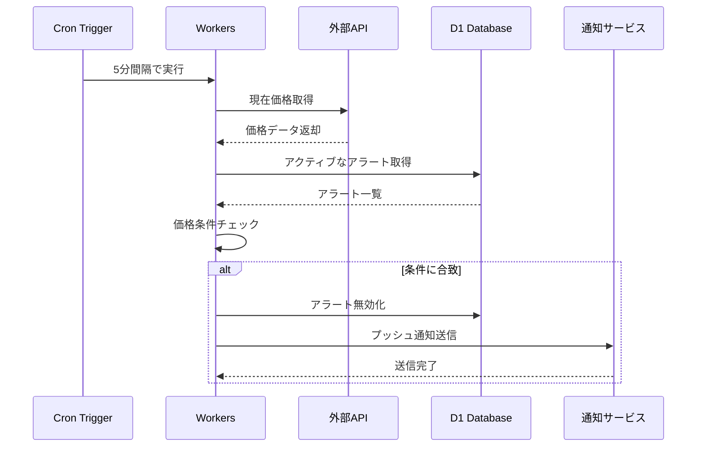

# 🎯 みんなやってるか！

> **暗号通貨投資をもっと身近に、みんなで一緒に成長できるプラットフォーム**

[](https://やってるか.みんな)
[](https://app.akindo.io/hackathons/27WABBdmRUvvOr1m)
[](https://reactrouter.com/)
[](https://xrpl.org/)
[](https://www.typescriptlang.org/)
[](https://workers.cloudflare.com/)

**🌐 今すぐ体験**: https://やってるか.みんな

---

## 🌟 プロジェクト概要

### 💡 ビジョン

「みんなやってるか！」は、**暗号通貨投資の民主化**を目指すコミュニティ主導型プラットフォームです。専門用語ばかりで難しい暗号通貨の世界を、**「みんな」で支え合い、情報を共有し、一緒に成長できる場**に変えることを目指しています。

### 🎯 解決する課題



### 📊 プロジェクト基本情報

| 項目               | 内容                                                                    |
| ------------------ | ----------------------------------------------------------------------- |
| **プロジェクト名** | みんなやってるか！(Minna Yatteru Ka!)                                   |
| **開発期間**       | 14 日間で MVP 完成                                                      |
| **開発体制**       | 1 名（フルスタック開発）                                                |
| **対象ユーザー**   | 暗号通貨初心者〜中級者                                                  |
| **現在の状況**     | ✅ 本番環境で稼働中                                                     |
| **ハッカソン**     | [Akindo.io](https://app.akindo.io/hackathons/27WABBdmRUvvOr1m) 提出済み |

---

## 🏗️ システムアーキテクチャ

### 全体構成図



### 技術スタック詳細

#### フロントエンド



#### バックエンド・API



---

## 🎨 主要機能

### 🔐 XUMM 認証システム

- **QR コード認証**: スマホでスキャンするだけの簡単ログイン
- **秘密鍵不要**: XUMM アプリが安全に管理
- **セッション管理**: [`app/cookie.server.ts`](app/cookie.server.ts)で実装

### 💬 コミュニティ機能

- **投稿システム**: [`app/routes/community/community.tsx`](app/routes/community/community.tsx)
- **カテゴリ分類**: trading, portfolio, news, question
- **IPFS 保存**: 分散ストレージで検閲耐性

### 📊 価格監視・アラート

- **リアルタイム価格**: WebSocket で即座に更新
- **価格アラート**: [`app/components/PriceAlerts.tsx`](app/components/PriceAlerts.tsx)
- **Cron 監視**: 5 分間隔での価格チェック

### 📈 チャート・分析

- **TradingView 統合**: [`app/routes/chart/`](app/routes/chart/)
- **ポートフォリオ管理**: [`app/routes/portfolio.tsx`](app/routes/portfolio.tsx)
- **市場分析**: リアルタイムデータ表示

---

## 🗄️ データベース設計

### ERD（エンティティ関係図）



### インデックス戦略

```sql
-- パフォーマンス最適化のためのインデックス
CREATE INDEX idx_users_xumm_token ON users(xumm_user_token);
CREATE INDEX idx_users_xrpl_address ON users(xrpl_address);
CREATE INDEX idx_posts_category_created ON posts(category, created_at);
CREATE INDEX idx_posts_user_created ON posts(user_id, created_at);
CREATE INDEX idx_alerts_user_active ON price_alerts(user_id, is_active);
CREATE INDEX idx_interactions_post ON user_interactions(post_id);
```

---

## 🔄 データフロー

### 認証フロー



### 投稿作成フロー



### 価格アラートフロー



---

## 📁 プロジェクト構造

### ディレクトリ構成

```
getting/
├── 📱 app/                          # React Router v7 アプリケーション
│   ├── 🧩 components/               # 再利用可能コンポーネント
│   │   ├── ui/                     # UIプリミティブ
│   │   ├── forms/                  # フォームコンポーネント
│   │   ├── Xaman.tsx              # XUMM認証UI (407行)
│   │   ├── PriceAlerts.tsx        # 価格アラート管理 (285行)
│   │   ├── Sidebar.tsx            # サイドバーナビ (216行)
│   │   └── ...                    # その他コンポーネント
│   ├── 🛣️ routes/                   # ページルート
│   │   ├── home.tsx               # ホームページ (653行)
│   │   ├── community/             # コミュニティ機能
│   │   │   └── community.tsx      # 投稿・表示 (313行)
│   │   ├── chart/                 # チャート機能
│   │   │   ├── chart.tsx          # メインチャート
│   │   │   ├── market.tsx         # 市場データ
│   │   │   └── linechart.tsx      # ラインチャート
│   │   └── portfolio.tsx          # ポートフォリオ (78行)
│   ├── 🔧 utils/                    # ユーティリティ関数
│   │   ├── xumm.ts                # XUMM SDK統合
│   │   ├── xrpl.ts                # XRPL接続管理
│   │   ├── data-manager.ts        # データ管理 (499行)
│   │   ├── storage.ts             # ストレージ管理 (394行)
│   │   └── ...                    # その他ユーティリティ
│   ├── 📝 types/                    # TypeScript型定義
│   ├── root.tsx                   # アプリケーションルート (66行)
│   ├── provider.tsx               # Jotai + SWR統合 (35行)
│   ├── template.tsx               # レイアウトテンプレート (21行)
│   └── cookie.server.ts           # セッション管理 (17行)
├── 🗄️ drizzle/                      # データベース関連
│   ├── schema.ts                  # テーブル定義 (96行)
│   ├── client.ts                  # DB接続設定 (50行)
│   ├── config.ts                  # Drizzle設定 (38行)
│   ├── repositories/              # リポジトリパターン
│   ├── modules/                   # データベースモジュール
│   └── migrations/                # マイグレーションファイル
├── ⚡ server/                       # API・サーバー
│   ├── api.ts                     # Hono APIルート (270行)
│   ├── middleware.ts              # 認証・CORS等 (68行)
│   ├── index.ts                   # サーバーエントリー (17行)
│   └── schema/                    # Valibotスキーマ
├── 🌐 workers/                      # Cloudflare Workers
│   └── app.ts                     # メインワーカー (40行)
├── 📚 docs/                         # ドキュメント
│   ├── presentation.md            # プレゼン資料 (481行)
│   ├── development-guide.md       # 開発ガイド (608行)
│   └── D1-explained.md           # D1データベース解説 (44行)
├── 🎯 .cursor/                      # Cursor AI設定
│   └── rules/                     # 開発ルール定義
├── sw.ts                          # Service Worker (51行)
├── wrangler.jsonc                 # Cloudflare設定 (58行)
├── package.json                   # 依存関係・スクリプト (83行)
└── README.md                      # このファイル
```

### 主要ファイルの役割

| ファイル                                                                   | 行数   | 役割                           |
| -------------------------------------------------------------------------- | ------ | ------------------------------ |
| [`app/routes/home.tsx`](app/routes/home.tsx)                               | 653 行 | メインダッシュボード・価格表示 |
| [`app/components/Xaman.tsx`](app/components/Xaman.tsx)                     | 407 行 | XUMM 認証・ウォレット連携      |
| [`app/routes/community/community.tsx`](app/routes/community/community.tsx) | 313 行 | コミュニティ投稿・表示         |
| [`app/components/PriceAlerts.tsx`](app/components/PriceAlerts.tsx)         | 285 行 | 価格アラート設定・管理         |
| [`server/api.ts`](server/api.ts)                                           | 270 行 | RESTful API・OpenAPI 仕様      |
| [`app/components/Sidebar.tsx`](app/components/Sidebar.tsx)                 | 216 行 | ナビゲーション・メニュー       |

---

## 🚀 開発・デプロイ

### 開発環境セットアップ

```bash
# 1. 依存関係インストール
bun install

# 2. 環境変数設定
cp .env.example .dev.vars

# 3. データベース初期化
bun run db:generate
bun run db:migrate
bun run db:seed

# 4. 開発サーバー起動
bun run dev
```

### 主要コマンド

```bash
# 開発
bun dev                    # 開発サーバー起動
bun run typecheck         # 型チェック
bun run lint              # コード品質チェック

# データベース
bun run db:studio         # Drizzle Studio起動
bun run db:migrate        # マイグレーション実行
bun run db:seed           # シードデータ投入

# デプロイ
bun run build             # プロダクションビルド
bun run deploy            # Cloudflareにデプロイ
```

### 技術選定理由

| 技術                   | バージョン | 選定理由                                     |
| ---------------------- | ---------- | -------------------------------------------- |
| **React Router**       | v7.6.2     | 最新の SSR 対応、ファイルベースルーティング  |
| **Cloudflare Workers** | -          | エッジコンピューティング、グローバル高速配信 |
| **Hono**               | v4.7.11    | 軽量高速、OpenAPI 統合、型安全性             |
| **Drizzle ORM**        | v0.44.2    | 型安全、パフォーマンス、SQLite サポート      |
| **XUMM**               | v1.8.0     | 秘密鍵管理不要、UX 優秀、XRPL 統合           |
| **Jotai**              | v2.12.5    | 軽量状態管理、React Suspense 対応            |
| **SWR**                | v2.3.3     | データフェッチング、キャッシュ最適化         |
| **Valibot**            | v1.1.0     | 軽量バリデーション、TypeScript 統合          |

---

## 📈 パフォーマンス指標

### Core Web Vitals

- **LCP**: < 1.2s (Cloudflare Workers + SSR)
- **FID**: < 100ms (軽量 JavaScript)
- **CLS**: < 0.1 (安定したレイアウト)

### 技術的メトリクス

- **バンドルサイズ**: < 200KB (gzip)
- **初回描画**: < 800ms
- **API 応答時間**: < 50ms (エッジ配信)
- **データベースクエリ**: < 10ms (D1 + インデックス)

---

## 🔗 関連リンク

### 🌐 本番環境

- **メインサイト**: https://やってるか.みんな
- **API 仕様**: https://やってるか.みんな/api/docs
- **ヘルスチェック**: https://やってるか.みんな/health

### 📚 ドキュメント

- **開発ガイド**: [`docs/development-guide.md`](docs/development-guide.md)
- **プレゼン資料**: [`docs/presentation.md`](docs/presentation.md)
- **D1 データベース**: [`docs/D1-explained.md`](docs/D1-explained.md)

### 🏆 ハッカソン

- **提出ページ**: [Akindo.io](https://app.akindo.io/hackathons/27WABBdmRUvvOr1m)
- **デモ動画**: [YouTube](https://youtube.com/watch?v=demo)

### 🔧 開発ツール

- **Drizzle Studio**: `bun run db:studio`
- **API Explorer**: https://やってるか.みんな/api/editor
- **Cloudflare Dashboard**: [Workers Console](https://dash.cloudflare.com/)

---

## 🤝 コントリビューション

このプロジェクトは現在個人開発ですが、将来的にはコミュニティ主導での開発を予定しています。

### 開発に参加したい方

1. **Issue 作成**: バグ報告・機能提案
2. **Pull Request**: コード改善・新機能
3. **ドキュメント**: 翻訳・説明改善
4. **テスト**: ユーザビリティテスト

### 連絡先

- **Twitter**: [@your_twitter](https://twitter.com/your_twitter)
- **Discord**: [コミュニティサーバー](https://discord.gg/your_server)
- **Email**: contact@やってるか.みんな

---

## 📄 ライセンス

MIT License - 詳細は [LICENSE](LICENSE) ファイルを参照してください。

---

<div align="center">

**🎯 みんなやってるか！**

_暗号通貨投資をもっと身近に、みんなで一緒に成長しよう_

[](https://github.com/your-username/getting)
[](https://twitter.com/your_twitter)

</div>
