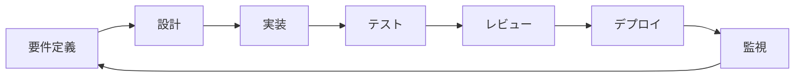

# 🚀 開発ガイド

> **みんなやってるか！** プロジェクトの実践的開発ガイド

---

## 📋 目次

1. [開発環境セットアップ](#開発環境セットアップ)
2. [プロジェクト構造](#プロジェクト構造)
3. [開発ワークフロー](#開発ワークフロー)
4. [実装パターン](#実装パターン)
5. [デバッグ・トラブルシューティング](#デバッグトラブルシューティング)
6. [デプロイメント](#デプロイメント)

---

## 🛠️ 開発環境セットアップ

### 前提条件

```bash
# 必要なツール
- Node.js 18+
- npm または yarn
- Git
- VS Code (推奨)
```

### 初期セットアップ

```bash
# 1. リポジトリクローン
git clone https://github.com/your-username/minna-yatteru-ka.git
cd minna-yatteru-ka

# 2. 依存関係インストール
npm install

# 3. 環境変数設定
cp .env.example .env.local

# 4. データベース初期化
npm run db:generate
npm run db:migrate

# 5. 開発サーバー起動
npm run dev
```

### 環境変数設定

```env
# .env.local
# XUMM設定
XUMM_API_KEY=your_xumm_api_key
XUMM_API_SECRET=your_xumm_api_secret

# Cloudflare設定（本番環境用）
CLOUDFLARE_ACCOUNT_ID=your_account_id
CLOUDFLARE_D1_DATABASE_ID=your_database_id
CLOUDFLARE_API_TOKEN=your_api_token

# XRPL設定
XRPL_NETWORK=testnet
XRPL_WEBSOCKET_URL=wss://s.altnet.rippletest.net:51233

# IPFS設定
PINATA_JWT=your_pinata_jwt_token
```

### VS Code 設定

```json
// .vscode/settings.json
{
  "typescript.preferences.importModuleSpecifier": "relative",
  "editor.formatOnSave": true,
  "editor.codeActionsOnSave": {
    "source.fixAll.eslint": true
  },
  "files.associations": {
    "*.css": "tailwindcss"
  }
}
```

### 推奨拡張機能

```json
// .vscode/extensions.json
{
  "recommendations": [
    "bradlc.vscode-tailwindcss",
    "esbenp.prettier-vscode",
    "dbaeumer.vscode-eslint",
    "ms-vscode.vscode-typescript-next",
    "formulahendry.auto-rename-tag",
    "christian-kohler.path-intellisense"
  ]
}
```

---

## 📁 プロジェクト構造

### ディレクトリ概要

```
├── app/                          # アプリケーションコア
│   ├── components/               # 再利用可能コンポーネント
│   │   ├── ui/                  # UIプリミティブ
│   │   │   ├── Button.tsx       # ボタンコンポーネント
│   │   │   ├── Modal.tsx        # モーダルコンポーネント
│   │   │   └── Alert.tsx        # アラートコンポーネント
│   │   ├── forms/               # フォームコンポーネント
│   │   │   ├── PostForm.tsx     # 投稿フォーム
│   │   │   └── AddressInput.tsx # アドレス入力
│   │   └── charts/              # チャートコンポーネント
│   │       └── PriceChart.tsx   # 価格チャート
│   ├── routes/                  # ページルート
│   │   ├── home.tsx            # ホームページ
│   │   ├── community/          # コミュニティ機能
│   │   │   └── community.tsx   # コミュニティページ
│   │   └── portfolio/          # ポートフォリオ管理
│   ├── utils/                   # ユーティリティ関数
│   │   ├── xrpl.ts             # XRPL関連機能
│   │   ├── xumm.ts             # XUMM認証
│   │   ├── validation.ts       # バリデーション
│   │   ├── storage.ts          # ストレージ管理
│   │   └── id-generator.ts     # ID生成
│   └── types/                   # TypeScript型定義
│       ├── database.types.ts    # データベース型
│       ├── xrpl.types.ts       # XRPL型
│       └── api.types.ts        # API型
├── drizzle/                     # データベース関連
│   ├── schema.ts               # DBスキーマ
│   ├── config.ts               # DB設定
│   ├── client.ts               # DBクライアント
│   ├── repositories/           # リポジトリパターン
│   │   ├── index.ts            # エクスポート
│   │   ├── base.repository.ts  # 基底リポジトリ
│   │   ├── user.repository.ts  # ユーザーリポジトリ
│   │   └── post.repository.ts  # 投稿リポジトリ
│   └── migrations/             # マイグレーション
├── docs/                        # ドキュメント
│   ├── presentation.md         # 発表資料
│   ├── architecture.md         # アーキテクチャ設計
│   └── development-guide.md    # 開発ガイド
└── public/                      # 静的ファイル
```

### ファイル命名規則

```typescript
// コンポーネント: PascalCase
UserProfile.tsx;
PostCard.tsx;
PriceChart.tsx;

// ユーティリティ: kebab-case
xrpl - utils.ts;
data - manager.ts;
id - generator.ts;

// 型定義: kebab-case + .types.ts
database.types.ts;
api.types.ts;
xrpl.types.ts;

// ページルート: kebab-case
home.tsx;
community.tsx;
portfolio.tsx;
```

---

## 🔄 開発ワークフロー

### Git ワークフロー

```bash
# 1. 新機能ブランチ作成
git checkout -b feature/post-creation

# 2. 開発作業
# ... コード変更 ...

# 3. コミット前チェック
npm run type-check
npm run lint
npm run test

# 4. コミット
git add .
git commit -m "feat: add post creation functionality"

# 5. プッシュ
git push origin feature/post-creation

# 6. プルリクエスト作成
# GitHub上でPR作成
```

### コミットメッセージ規約

```bash
# 形式: type(scope): description

# 例
feat(community): add post creation form
fix(xrpl): resolve balance formatting issue
docs(readme): update installation instructions
style(ui): improve button component styling
refactor(utils): extract common validation logic
test(api): add unit tests for post repository
chore(deps): update dependencies
```

### 開発サイクル



---

## 💻 実装パターン

### 1. 新しいページの作成

```typescript
// app/routes/new-page.tsx
import type { Route } from "./+types/new-page";
import { useLoaderData } from "react-router";

// サーバーサイドデータ取得
export async function loader({ params }: Route.LoaderArgs) {
  const data = await fetchData(params.id);
  return { data };
}

// フォーム処理
export async function action({ request }: Route.ActionArgs) {
  const formData = await request.formData();
  const submission = parseWithValibot(formData, { schema: MySchema });

  if (submission.status !== "success") {
    return data({ lastResult: submission.reply() }, { status: 400 });
  }

  await processData(submission.value);
  return redirect("/success");
}

// コンポーネント
export default function NewPage({ loaderData }: Route.ComponentProps) {
  const { data } = useLoaderData<typeof loader>();

  return (
    <div className="container mx-auto p-4">
      <h1 className="text-2xl font-bold">新しいページ</h1>
      {/* コンテンツ */}
    </div>
  );
}
```

### 2. 新しいコンポーネントの作成

```typescript
// app/components/ui/NewComponent.tsx
import { forwardRef } from "react";

interface NewComponentProps {
  title: string;
  variant?: "primary" | "secondary";
  children: React.ReactNode;
  className?: string;
}

export const NewComponent = forwardRef<HTMLDivElement, NewComponentProps>(
  ({ title, variant = "primary", children, className = "", ...props }, ref) => {
    const variantClasses = {
      primary: "bg-primary text-primary-content",
      secondary: "bg-secondary text-secondary-content",
    };

    return (
      <div ref={ref} className={`card shadow-lg ${variantClasses[variant]} ${className}`} {...props}>
        <div className="card-body">
          <h2 className="card-title">{title}</h2>
          {children}
        </div>
      </div>
    );
  }
);

NewComponent.displayName = "NewComponent";
```

### 3. 新しい API エンドポイントの作成

```typescript
// server/api/new-endpoint.ts
import { Hono } from "hono";
import { parseWithValibot } from "conform-to-valibot";
import { NewDataSchema } from "~/utils/validation";

const app = new Hono<{ Bindings: Env }>();

// GET /api/new-endpoint
app.get("/", async (c) => {
  try {
    const db = createDatabaseClient(c.env.DB);
    const repository = new DataRepository(db);

    const data = await repository.findMany();

    return c.json({ success: true, data });
  } catch (error) {
    return c.json({ success: false, error: error.message }, 500);
  }
});

// POST /api/new-endpoint
app.post("/", async (c) => {
  try {
    const body = await c.req.json();
    const validation = parseWithValibot(body, NewDataSchema);

    if (validation.status !== "success") {
      return c.json({ success: false, errors: validation.issues }, 400);
    }

    const db = createDatabaseClient(c.env.DB);
    const repository = new DataRepository(db);

    const result = await repository.create(validation.value);

    return c.json({ success: true, data: result }, 201);
  } catch (error) {
    return c.json({ success: false, error: error.message }, 500);
  }
});

export default app;
```

### 4. 新しいバリデーションスキーマの作成

```typescript
// app/utils/validation.ts
import * as v from "valibot";

export const NewDataSchema = v.object({
  title: v.pipe(
    v.string(),
    v.minLength(1, "タイトルは必須です"),
    v.maxLength(100, "タイトルは100文字以内で入力してください")
  ),
  content: v.pipe(
    v.string(),
    v.minLength(10, "コンテンツは10文字以上で入力してください"),
    v.maxLength(1000, "コンテンツは1000文字以内で入力してください")
  ),
  category: v.picklist(["type1", "type2", "type3"], "カテゴリを選択してください"),
  isPublic: v.boolean(),
  tags: v.optional(v.array(v.string())),
});

export type NewData = v.InferInput<typeof NewDataSchema>;
```

### 5. 新しい Jotai Atom の作成

```typescript
// app/atoms/new-atoms.ts
import { atom } from "jotai";
import { atomWithStorage } from "jotai/utils";

// 基本atom
export const newDataAtom = atom<NewData[]>([]);

// 派生atom
export const filteredDataAtom = atom((get) => {
  const data = get(newDataAtom);
  const filter = get(filterAtom);
  return data.filter((item) => filter === "all" || item.category === filter);
});

// ストレージ付きatom
export const userPreferencesAtom = atomWithStorage("userPreferences", {
  theme: "light",
  language: "ja",
});

// 非同期atom
export const asyncDataAtom = atom(async (get) => {
  const response = await fetch("/api/data");
  return response.json();
});
```

---

## 🐛 デバッグ・トラブルシューティング

### よくある問題と解決方法

#### 1. TypeScript エラー

```bash
# 型チェック実行
npm run type-check

# よくあるエラー
# - モジュールが見つからない → インポートパス確認
# - 型が一致しない → 型定義確認
# - プロパティが存在しない → インターフェース確認
```

#### 2. ESLint エラー

```bash
# リント実行
npm run lint

# 自動修正
npm run lint:fix

# よくあるエラー
# - prefer-for-of → forEach を for...of に変更
# - no-unused-vars → 未使用変数を削除
# - @typescript-eslint/no-explicit-any → any型を具体的な型に変更
```

#### 3. データベース関連

```bash
# マイグレーション実行
npm run db:migrate

# スキーマ生成
npm run db:generate

# データベースリセット
npm run db:reset
```

#### 4. XUMM 認証問題

```typescript
// デバッグ用ログ
console.log("XUMM API Key:", process.env.XUMM_API_KEY?.slice(0, 8) + "...");
console.log("Payload UUID:", payload.uuid);
console.log("Signature verification:", isValid);

// よくある問題
// - API キーが正しくない
// - ネットワーク設定が間違っている
// - 署名検証のタイミング問題
```

#### 5. SWR キャッシュ問題

```typescript
// キャッシュクリア
import { mutate } from "swr";

// 特定のキーをクリア
mutate("/api/posts");

// 全てのキャッシュをクリア
mutate(() => true, undefined, { revalidate: false });
```

### デバッグツール

```typescript
// 開発環境専用デバッグ関数
export const debug = {
  log: (message: string, data?: any) => {
    if (process.env.NODE_ENV === "development") {
      console.log(`[DEBUG] ${message}`, data);
    }
  },

  performance: (label: string, fn: () => void) => {
    if (process.env.NODE_ENV === "development") {
      console.time(label);
      fn();
      console.timeEnd(label);
    } else {
      fn();
    }
  },

  trace: (error: Error) => {
    if (process.env.NODE_ENV === "development") {
      console.error("Error trace:", error.stack);
    }
  },
};
```

---

## 🚀 デプロイメント

### ローカル開発

```bash
# 開発サーバー起動
npm run dev

# 型チェック（監視モード）
npm run type-check:watch

# テスト（監視モード）
npm run test:watch
```

### ステージング環境

```bash
# ビルド
npm run build

# ローカルでプレビュー
npm run preview

# Cloudflare Workers にデプロイ
npm run deploy:staging
```

### 本番環境

```bash
# 本番ビルド
npm run build

# 本番デプロイ
npm run deploy

# データベースマイグレーション
npm run db:migrate:prod
```

### 環境変数管理

```bash
# 開発環境
.env.local

# ステージング環境
wrangler secret put XUMM_API_KEY --env staging

# 本番環境
wrangler secret put XUMM_API_KEY --env production
```

### デプロイチェックリスト

- [ ] 型チェック通過
- [ ] リント通過
- [ ] テスト通過
- [ ] ビルド成功
- [ ] 環境変数設定
- [ ] データベースマイグレーション
- [ ] セキュリティ検証
- [ ] パフォーマンステスト

---

## 📚 参考資料

### 公式ドキュメント

- [React Router v7](https://reactrouter.com/dev)
- [Jotai](https://jotai.org/)
- [SWR](https://swr.vercel.app/)
- [Valibot](https://valibot.dev/)
- [DaisyUI](https://daisyui.com/)
- [Cloudflare Workers](https://developers.cloudflare.com/workers/)
- [XRPL](https://xrpl.org/docs.html)
- [XUMM](https://xumm.readme.io/)

### 内部ドキュメント

- [アーキテクチャ設計書](./architecture.md)
- [開発ルール](../.cursor/rules/development-rules.md)
- [発表資料](./presentation.md)

---

このガイドに従って開発を進めることで、「みんなやってるか！」プロジェクトの品質と一貫性を保ちながら、効率的な開発が可能になります。
